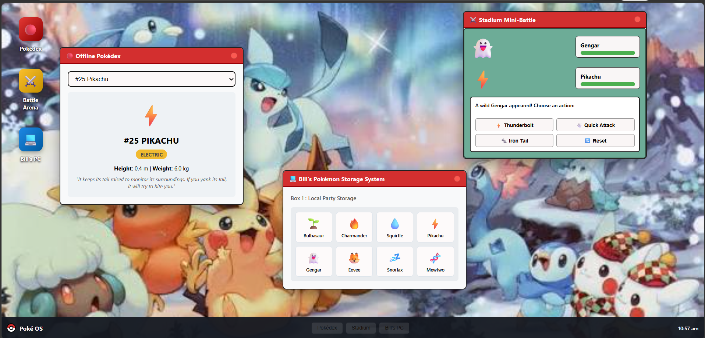

# PokéOS

A Pokemon-themed web operating system built entirely with web technologies HTML , CSS and JS. PokéOS provides a desktop experience inside your browser featuring draggable windows, dynamic focus management, a Pokédex, an interactive turn-based battle mini-game, and Bill's PC storage system.

---

## Features

* **Desktop Environment:**

* **Offline Pokédex:**
  * Detailed stats: type classifications, height, weight, and retro Pokédex lore entries.

* **Battle Stadium:**
  * Interactive turn-based combat mini-game (Pikachu vs. Gengar).

* **Bill's PC Storage:**
  * Pokémon storage box layout rendering active Pokémon.

---

## 🛠️ Built With

* **HTML** 
* **CSS** 
* **JavaScript** 

## Project Structure

poke-os/
│
├── index.html        
├── styles.css       
├── script.js       
└── background.png   

## How to run locally 
1. Download or clone this folder.
2. Make sure `index.html`, `styles.css`, and `script.js` are in the same directory.
3. Double-click `index.html` to open it in Chrome or any browser.
